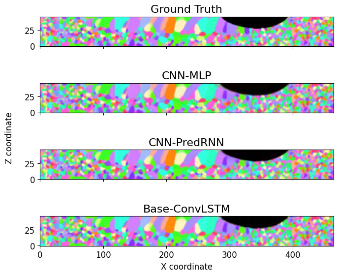
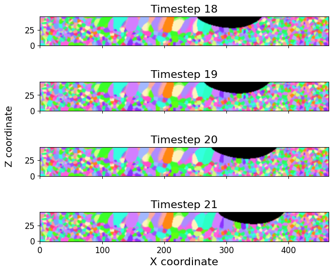

# LASERNet

Spatiotemporal deep learning for predicting microstructure evolution in laser-based additive manufacturing.

## Highlights
- Multiple architectures (CNN-LSTM, PredRNN, MLP baselines)
- End-to-end training/evaluation/prediction scripts
- Reproducible experiments via YAML configs

## Installation
This project uses uv and Python 3.12.

```bash
uv sync --locked --dev
```

## Data setup
On DTU HPC, data and models uses large amount of storage space and is therefore stored on a seperate blackhole scratch drive (≈50 GB). Thus, it is important to make symlinks to `data/` and `models/` folders, so that they are relative to the project root directory.

```bash
ln -s "$BLACKHOLE/models" /zhome/b0/7/168550/Github/LASERNet/models
ln -s "$BLACKHOLE/data" /zhome/b0/7/168550/Github/LASERNet/data
```

### Download dataset locally
The dataset is hosted at https://storage.googleapis.com/lasernet-data. Download it into a relative `./data` folder from the project root.

Use `wget` to mirror the bucket over HTTPS:

```bash
mkdir -p data
wget -r -np -nH --cut-dirs=1 -R "index.html*" -P data https://storage.googleapis.com/lasernet-data/
```

Or use `curl` with `--remote-name-all`:

```bash
mkdir -p data
curl -L --remote-name-all --output-dir data https://storage.googleapis.com/lasernet-data/
```

## Quickstart
Train, evaluate, and predict via CLI scripts:

```bash
uv run src/lasernet/train.py --network deep_cnn_lstm_large --field-type microstructure
uv run src/lasernet/evaluate.py --network deep_cnn_lstm_large --field-type microstructure
uv run src/lasernet/predict.py --network deep_cnn_lstm_large --field-type microstructure --timestep 21
```

Experiments from YAML configs:

```bash
uv run src/lasernet/experiments/experiments.py
```

## Results

**Model prediction comparison (timestep 21).** Qualitative comparison across selected models for a fixed timestep.



**Timestep evolution (18 → 21).** Predicted temporal evolution in the microstructure field.



**MSE error maps.** Spatial error distribution highlighting challenging regions.


## Tests

```bash
uv run pytest -q
```

## Project structure

```txt
├── .github/                  # CI workflows
├── configs/                  # Experiment configs
├── data/                     # Data (raw/processed)
├── models/                   # Model checkpoints
├── notebooks/                # Demos and exploration
├── results/                  # Evaluation artifacts
├── src/lasernet/             # Package source
│   ├── data/                 # Dataset + normalization
│   ├── models/               # Model implementations
│   ├── evaluate.py           # Evaluation CLI
│   ├── predict.py            # Prediction CLI
│   ├── train.py              # Training CLI
│   └── utils.py              # Utilities
└── tests/                    # Unit tests
```
