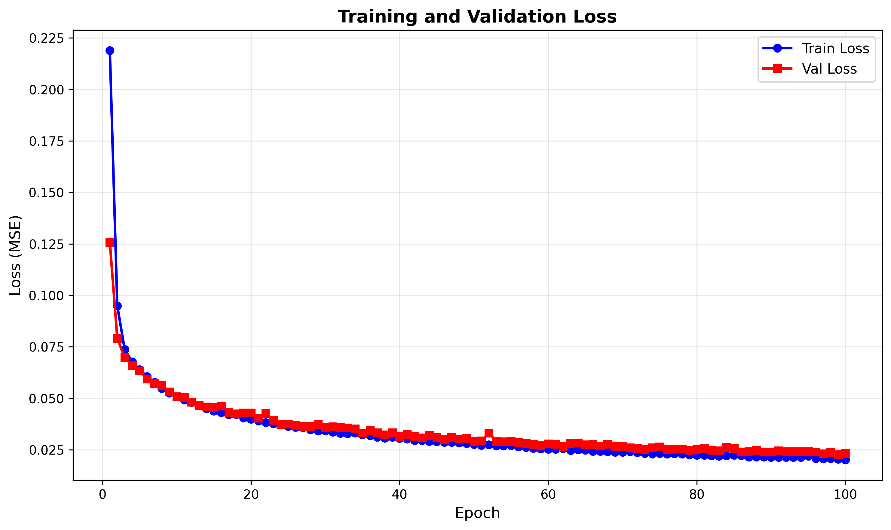
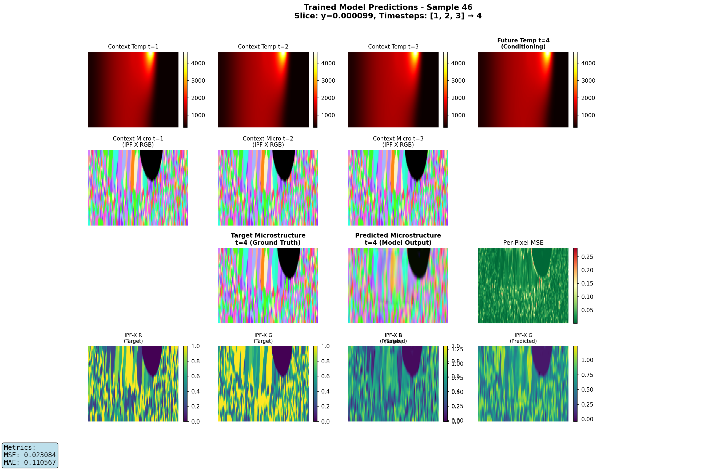
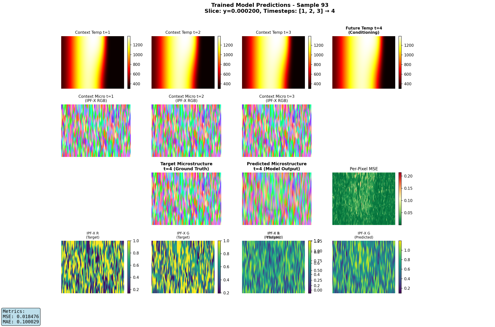
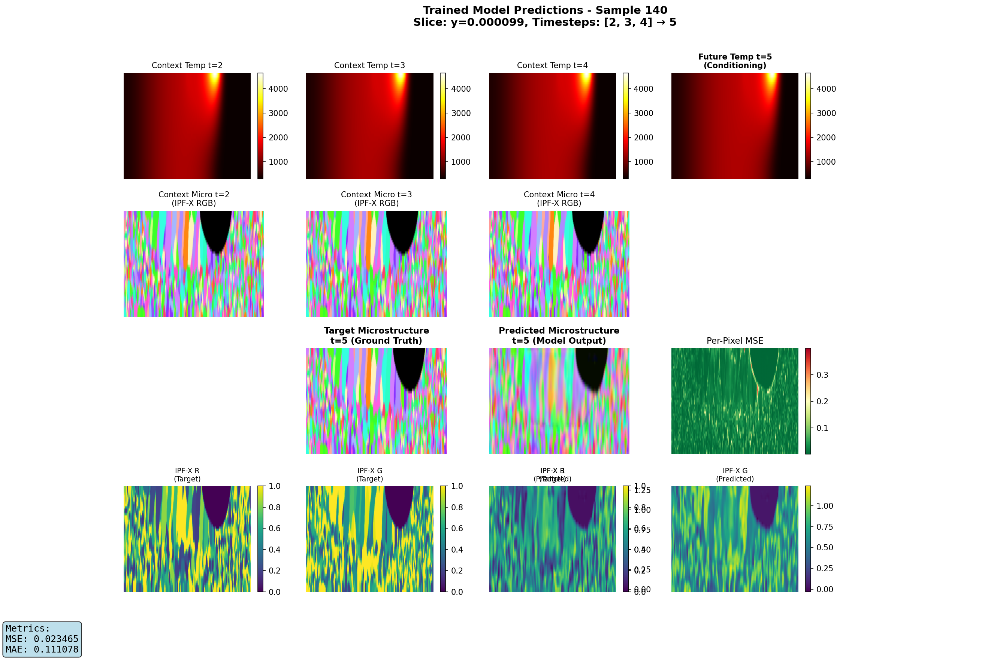

# Microstructure Prediction Training Results

**Training Date:** November 20, 2025
**Model:** MicrostructureCNN_LSTM (Dual-Encoder CNN-LSTM)
**Task:** Predict next microstructure frame from temperature + microstructure history

---

## Model Architecture

The model uses a dual-encoder architecture:
- **Context Encoder**: Processes 3 frames of temperature + microstructure (10 channels total)
- **Future Temperature Encoder**: Processes next temperature frame (conditioning)
- **ConvLSTM**: Temporal modeling of spatial features
- **Fusion Layer**: Combines LSTM output with future temperature features
- **Decoder**: Upsamples to predict 9 IPF microstructure channels

**Total Parameters:** 440,425

### Input/Output
- **Input**:
  - Context: 3 frames × (1 temp + 9 micro) = [B, 3, 10, H, W]
  - Future temperature: [B, 1, H, W] (conditioning)
- **Output**: Next microstructure (9 IPF channels): [B, 9, H, W]

---

## Training Configuration

```json
{
  "epochs": 100,
  "batch_size": 16,
  "learning_rate": 0.001,
  "optimizer": "Adam",
  "loss": "MSELoss",
  "sequence_length": 3,
  "plane": "xz",
  "split_ratio": "12:6:6",
  "preload": true
}
```

### Dataset Split
- **Train**: 12 timesteps (752 samples) - used for gradient updates
- **Validation**: 6 timesteps (188 samples) - used for model selection
- **Test**: 6 timesteps (188 samples) - held out for final evaluation

---

## Training Results

### Loss Curves



The model converged well over 100 epochs:
- **Final Training Loss**: 0.0202
- **Best Validation Loss**: 0.0227 (epoch 103, used for best_model.pt)
- **Test Loss**: 0.0257

The close alignment between validation and test losses indicates good generalization with minimal overfitting.

### Performance Summary

| Split | MSE Loss | Samples | Notes |
|-------|----------|---------|-------|
| Train | 0.0202 | 752 | Final epoch |
| Val | 0.0227 | 188 | Best checkpoint |
| **Test** | **0.0257** | **188** | **Unseen data** |

**Key Observation:** Test loss is only 13% higher than validation loss, demonstrating strong generalization.

---

## Qualitative Results

### Test Set Predictions (Unseen Data)

Example predictions on test data (completely held out during training):

<table>
  <tr>
    <td></td>
    <td></td>
  </tr>
  <tr>
    <td></td>
    <td></td>
  </tr>
</table>

**Observations:**
- Model accurately predicts zero microstructure in molten regions (high temperature)
- Solidified regions show stable, consistent microstructure predictions
- Most error occurs near the solidification front where structure is actively forming

---

## Key Findings

### What the Model Learned Well

1. **Molten Metal Regions**: The model correctly predicts zero microstructure in high-temperature regions where metal is molten (above melting point). This shows it learned the physical constraint that molten metal has no crystalline structure.

2. **Stable Microstructure**: Once microstructure forms and solidifies, it remains stable over time. The model captures this temporal consistency accurately.

3. **Spatial Patterns**: The model maintains realistic spatial distributions of IPF (Inverse Pole Figure) orientations.

### Limitations Observed

1. **Prediction Challenge**: The task is somewhat imbalanced - most of the spatial domain contains either:
   - Molten metal (no structure, easy to predict)
   - Solidified structure (unchanging, easy to predict)

   Only a small region near the solidification front requires true prediction, where microstructure is actively forming.

2. **Loss Function Bias**: Current MSE loss treats all spatial regions equally, meaning the model gets high accuracy from correctly predicting the large stable/molten regions, even if solidification front predictions are imperfect.

---

## Ideas for Improvement

### 1. Extended Training
The loss curves show the model was still improving at epoch 100. Training for more epochs (150-200) would likely reduce loss further.

**Suggested action:**
```bash
python train_microstructure.py --epochs 200
```

### 2. Spatially-Weighted Loss Function

Create a loss function that focuses on the solidification region where microstructure is actively forming.

**Proposed implementation:**
```python
def solidification_weighted_loss(pred, target, temp, mask):
    """
    Weight loss by proximity to solidification temperature.
    Higher weight near melting point where structure forms.
    """
    # Identify solidification region (e.g., 1400-1500K)
    T_solidus = 1400  # Approximate solidus temperature
    T_liquidus = 1500  # Approximate liquidus temperature

    # Create spatial weight map
    temp_normalized = (temp - T_solidus) / (T_liquidus - T_solidus)
    weight = torch.exp(-((temp_normalized - 0.5) ** 2) / 0.1)  # Gaussian around mid-range
    weight = weight * mask  # Apply valid region mask

    # Weighted MSE
    mse = (pred - target) ** 2
    weighted_mse = (mse * weight.unsqueeze(1)).sum() / weight.sum()

    return weighted_mse
```

This would force the model to focus on the challenging solidification front rather than the trivial molten/solidified regions.

### 3. Spatial Cropping Strategy

Remove the bottom ~70% of each slice (Z-direction) which typically contains only stable solidified material.

**Benefits:**
- Reduces computational cost (smaller spatial dimensions)
- Focuses training on dynamic upper region where laser interaction occurs
- Removes "easy" predictions that dominate the loss

**Implementation:**
```python
# In dataset preprocessing
H_original = data.shape[-2]
crop_height = int(0.3 * H_original)  # Keep top 30%
data_cropped = data[..., :crop_height, :]  # [C, H_crop, W]
```

### 4. Multi-Task Learning

Add auxiliary prediction tasks that force the model to learn solidification dynamics:

- **Temperature gradient prediction**: Predict ∇T to learn thermal gradients
- **Phase field**: Predict binary solid/liquid phase
- **Solidification velocity**: Predict rate of solidification front movement

This would provide additional supervision signals specifically about the solidification process.

### 5. Temporal Attention Mechanism

Replace fixed 3-frame history with an attention mechanism that learns which historical frames are most relevant for prediction. Microstructure formation may depend on thermal history over varying timescales.

---

## Reproducing Results

### Training
```bash
# Full training run (100 epochs)
python train_microstructure.py \
  --epochs 100 \
  --batch-size 16 \
  --lr 1e-3 \
  --split-ratio "12,6,6" \
  --plane xz
```

### Evaluation
```bash
# Visualize predictions on test set
python visualize_trained_predictions.py \
  --run-dir runs_microstructure/2025-11-20_13-27-31 \
  --checkpoint best_model.pt \
  --split test \
  --split-ratio "12,6,6" \
  --num-samples 5
```

### Model Files
- **Best Model**: `checkpoints/best_model.pt` (epoch 103, val_loss=0.0227)
- **Final Model**: `checkpoints/final_model.pt` (epoch 100)
- **Configuration**: `config.json`
- **Training History**: `history.json`

---

## Next Steps

**Priority 1 (Easy wins):**
1. Train for 200 epochs to see if loss continues decreasing
2. Implement spatial cropping to remove bottom 70% of data
3. Analyze predictions specifically at solidification front

**Priority 2 (Medium effort):**
4. Implement temperature-weighted loss function
5. Add phase field prediction as auxiliary task
6. Experiment with different sequence lengths (5-7 frames)

**Priority 3 (Research directions):**
7. Investigate attention mechanisms for temporal modeling
8. Try different architectures (U-Net decoder, Transformer-based)
9. Incorporate physics-informed constraints (grain growth models)

---

## References

- Training script: `train_microstructure.py`
- Model implementation: `lasernet/model/MicrostructureCNN_LSTM.py`
- Dataset: `lasernet/dataset/loading.py:MicrostructureSequenceDataset`
- Visualization: `visualize_trained_predictions.py`
